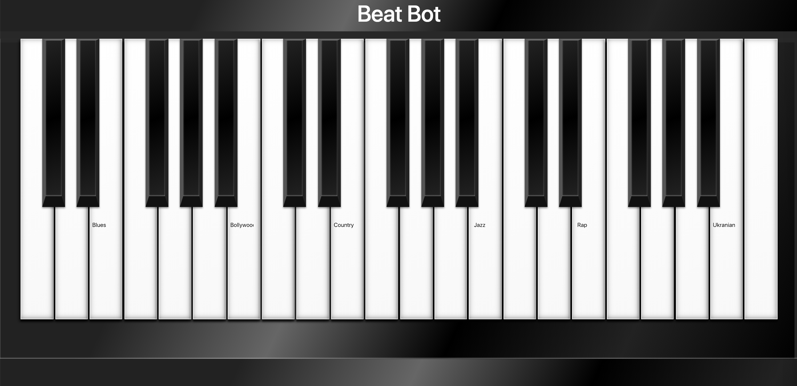

# AI Beat-Bot

 
 
Using the concepts of Machine Learning: RNN, LTSM, and CBLTSM the AI Beat Bot was implemented.

The AI Beat-Bot takes as input a collection of midi files and outputs AI generated music. The underlying model is a bidirectional LSTM recurrent neural network which maps the latent space of the collection of files and then samples from this underlying structure.

The model takes in a set of midi music files and generates a unique note/chord pattern within an output midi. This is processed in two phases: (1) Midi input files to trained weights, and (2) Trained weights to midi generated file.

Midi collection input -> model weights trained -> generated midi output

The model consists of two files:

functions.py contains the underlying functions of the model for both training and evaluation stages.
run.py executes the model from beginning of training to end of evaluation.

To run the model from beginning of training phase to end of evaluation phase, simply navigate to the model folder, adjust the hyperparameters and input paths as necessary and then run the program by typing python run.py

The AI Beat-Bot works in two phases: Training and Evaluation.

### Training

During the training phase, the model maps the latent space within the collection of music.  Two important files will be generated in this phase: weight file(s) and an input notes file.  These two files can then be plugged into the `weights_to_midi.ipynb` jupyter notebook to create midis directly from these inputs at any time.  The `run.py` will run to completion of evaluation phase and generate a midi file at the end of the run.  But the training phase will take up 99+% of processing time and will take several hours to fully execute to completion.    

The training phase is very time consuming; trained examples have been included in the `trained` folder for those less patient.  To generate a midi directly from trained weights, simply plug the filepath to the trained weights and accompanying input notes file into the `weights_to_midi.ipynb` jupyter notebook located within the `model` folder.  

### Evaluation

Utilizing the weight file generated from the training phase, the model will then "predict" a sequence of notes which represents a sample from the internal structure mapped.  A midi file is generated as output.  

If you have already created (full or partially-trained) weight files from the training phase, or use the pre-trained weights available in the `trained` folder, you can generate a midi file from the weight file.  To do so, simple open the `weights_to_midi.ipynb` jupyter notebook and input the weight filepath and input notes filepath accordingly.  Input notes file will be created when the model is first trained.  

The model default is to generate a weight file at the end of every epoch.  Once you have a weight file and the input notes file generated at the beginning of training, you can convert these files into a midi of generated music.  

### Resources

Blog post on [Medium](https://medium.com/@cipher813) and music samples on [SoundCloud.](https://soundcloud.com/cipher813)

[“Magenta.”](https://magenta.tensorflow.org/) Tensorflow.

Goodfellow, Ian. ["Deep Learning."](http://www.deeplearningbook.org/) MIT Press. 2016.

Brownlee, Jason. ["Stacked LSTM Networks."](https://machinelearningmastery.com/stacked-long-short-term-memory-networks/) August 18, 2017.

Brownlee, Jason. ["Understand the Difference Between Return Sequences and Return States for LSTMs in Keras."](https://machinelearningmastery.com/return-sequences-and-return-states-for-lstms-in-keras/) October 24, 2017.   

Dorsey, Brannon.  ["Using Machine Learning to Create New Melodies."](https://brangerbriz.com/blog/using-machine-learning-to-create-new-melodies/) May 10, 2017.

Nayebi, Aran. ["GRUV: Algorithmic Music Generation using Recurrent Neural Networks."](https://www.arxiv.org) Stanford University. 2015.  

Skúli, Sigurður.  ["How to Generate Music using a LSTM Neural Network in Keras."](https://towardsdatascience.com/how-to-generate-music-using-a-lstm-neural-network-in-keras-68786834d4c5) December 7, 2017.

Olah, Christopher. ["Understanding LSTM Networks."](https://colah.github.io/posts/2015-08-Understanding-LSTMs/) Colah's Blog. August 27, 2015.
